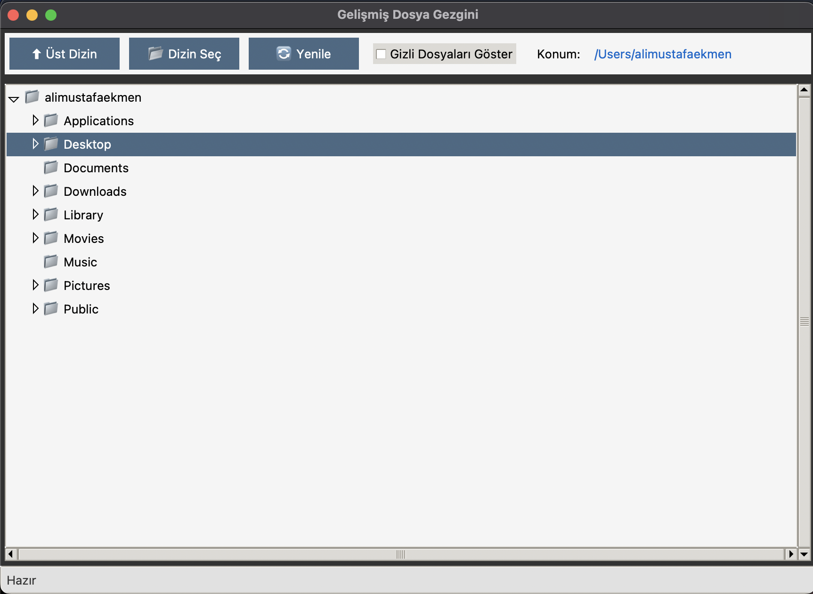
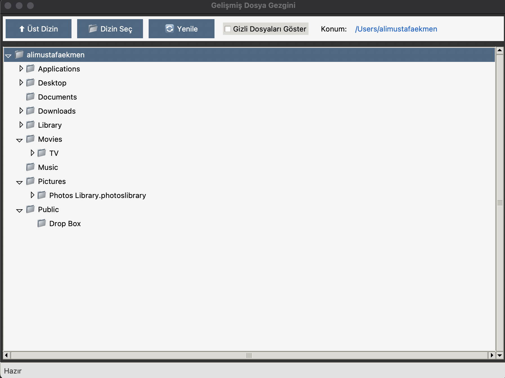

# 📁 FileExplorerApp - Gelişmiş Dosya Gezgini

Python ve Tkinter kullanılarak geliştirilmiş, kullanıcı dostu bir **dosya gezgini** uygulamasıdır. Dosya ve klasörlerinizi ağaç yapısında görüntüleyebilir, açabilir ve bilgilerini inceleyebilirsiniz.

A user-friendly **file explorer** application built with Python and Tkinter. Browse files and directories in a tree view, open files with default apps, and view detailed file information.

---

## 📸 Ekran Görüntüleri / Screenshots





---

## ✨ Özellikler / Features

| Özellik (TR) | Feature (EN) |
|---|---|
| 📁 Ağaç yapısında dizin gezinme | 📁 Tree-based directory browsing |
| 🔍 Dosya türüne göre emoji ikonları | 🔍 Emoji icons by file type |
| 👁️ Gizli dosyaları göster/gizle | 👁️ Show/hide hidden files |
| 📋 Dosya yolunu panoya kopyalama | 📋 Copy file path to clipboard |
| ℹ️ Dosya/klasör bilgi penceresi | ℹ️ File/directory info window |
| ⬆ Üst dizine gitme (Backspace) | ⬆ Navigate to parent (Backspace) |
| 🔄 Görünümü yenileme | 🔄 Refresh view |
| 📂 Dizin seçme penceresi | 📂 Directory picker dialog |
| 🖱️ Sağ tıklama bağlam menüsü | 🖱️ Right-click context menu |
| 🐳 Docker desteği | 🐳 Docker support |

---

## 🛠️ Gereksinimler / Requirements

- **Python 3.7+**
- **Tkinter** (Python ile birlikte gelir / comes bundled with Python)
- **Docker** (opsiyonel / optional)

---

## 🚀 Kurulum ve Çalıştırma / Installation & Usage

### 1. Projeyi Klonlayın / Clone the Project

```bash
git clone https://github.com/alimustafaekmen/FileExplorerApp.git
cd FileExplorerApp
```

### 2. Doğrudan Çalıştırma / Run Directly

```bash
# Varsayılan dizin ile çalıştır (ev dizini)
# Run with default directory (home directory)
python run.py

# Belirli bir dizin ile çalıştır
# Run with a specific directory
python run.py /path/to/directory
```

### 3. Docker ile Çalıştırma / Run with Docker

#### Docker Compose (Önerilen / Recommended)

```bash
docker-compose up --build
```

#### Manuel Docker Komutları / Manual Docker Commands

```bash
# İmajı derle / Build the image
docker build -t file-explorer-app .

# Linux'ta çalıştır / Run on Linux
xhost +local:docker
docker run -e DISPLAY=$DISPLAY -v /tmp/.X11-unix:/tmp/.X11-unix file-explorer-app

# macOS'ta çalıştır (XQuartz gerekli) / Run on macOS (XQuartz required)
xhost +localhost
docker run -e DISPLAY=host.docker.internal:0 file-explorer-app
```

> **macOS Notu / macOS Note:**
> Docker ile GUI uygulaması çalıştırmak için [XQuartz](https://www.xquartz.org/) kurulu olmalıdır.
> XQuartz Preferences → Security → "Allow connections from network clients" aktif edin.
>
> To run GUI apps via Docker on macOS, install [XQuartz](https://www.xquartz.org/).
> Enable "Allow connections from network clients" in XQuartz Preferences → Security.

---

## 📂 Proje Yapısı / Project Structure

```
FileExplorerApp/
│
├── run.py              # Giriş noktası / Entry point
├── src/                # Kaynak kod dizini / Source code directory
│   ├── __init__.py
│   ├── file_explorer.py# Ana uygulama (GUI) / Main application (GUI)
│   ├── tree_node.py    # Ağaç düğümü sınıfı / Tree node class
│   └── file_utils.py   # Yardımcı fonksiyonlar / Utility functions
│
├── assets/             # Görseller / Assets
│   ├── Screenshot1.png
│   └── Screenshot2.png
│
├── Dockerfile          # Docker imaj yapılandırması / Docker image config
├── docker-compose.yml  # Docker Compose yapılandırması / Docker Compose config
├── requirements.txt    # Bağımlılıklar / Dependencies
├── .gitignore          # Git yoksayma listesi / Git ignore list
└── README.md           # Bu dosya / This file
```

### Modül Açıklamaları / Module Descriptions

| Dosya | Açıklama (TR) | Description (EN) |
|---|---|---|
| `run.py` | Uygulamayı başlatır, komut satırı argümanı alabilir | Starts the app, accepts CLI directory argument |
| `file_explorer.py` | Tkinter GUI ve kullanıcı etkileşimlerini yönetir | Tkinter GUI and user interaction handling |
| `tree_node.py` | Dosya/klasör ağaç düğümü veri sınıfı | File/directory tree node data class |
| `file_utils.py` | Dosya ikonu, gizlilik kontrolü, boyut formatlama | File icon, hidden check, size formatting |

---

## 🖱️ Kullanım Kılavuzu / User Guide

| İşlem (TR) | Action (EN) | Nasıl / How |
|---|---|---|
| Klasör açma/kapama | Expand/collapse folder | Çift tıklama / Double-click |
| Dosya açma | Open file | Çift tıklama / Double-click |
| Bağlam menüsü | Context menu | Sağ tıklama / Right-click |
| Üst dizine gitme | Go to parent dir | `Backspace` tuşu / key |
| Yenileme | Refresh | 🔄 butonu / button |
| Gizli dosyalar | Hidden files | Araç çubuğundaki onay kutusu / Toolbar checkbox |

---

## 🧰 Kullanılan Teknolojiler / Technologies Used

- **Python 3** — Programlama dili / Programming language
- **Tkinter (ttk)** — GUI kütüphanesi / GUI library
- **Docker** — Konteynerizasyon / Containerization

---

## 📝 Lisans / License

Bu proje eğitim amaçlıdır. / This project is for educational purposes.

## 👤 Geliştirici / Developer

**Ali Mustafa Ekmen**
